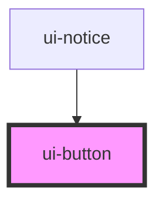

# ui-button

<!-- Auto Generated Below -->

## Overview

The library's one clickable control: a button, or a link when `href` is set.
`type="submit"` submits the enclosing light-DOM form through `ElementInternals`,
so a native `<form>` works across the shadow boundary.

## Properties

| Property   | Attribute  | Description                                                                      | Type                                              | Default       |
| ---------- | ---------- | -------------------------------------------------------------------------------- | ------------------------------------------------- | ------------- |
| `disabled` | `disabled` |                                                                                  | `boolean`                                         | `false`       |
| `href`     | `href`     | Render as a link to this URL instead of a button.                                | `string \| undefined`                             | `undefined`   |
| `type`     | `type`     | `submit` submits the enclosing form; `button` does nothing on its own.           | `"button" \| "submit"`                            | `'button'`    |
| `variant`  | `variant`  | `primary` is the single accent-filled action per view; everything else is quiet. | `"danger" \| "ghost" \| "primary" \| "secondary"` | `'secondary'` |

## Slots

| Slot | Description      |
| ---- | ---------------- |
|      | The default slot |

## Dependencies

### Used by

 - [ui-notice](../ui-notice)

### Graph

----------------------------------------------

*Built with [StencilJS](https://stenciljs.com/)*
