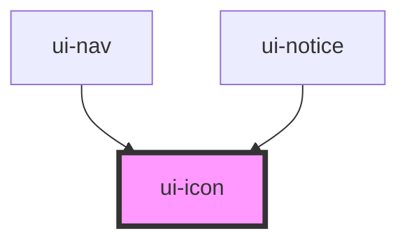

# ui-icon

<!-- Auto Generated Below -->

## Overview

Inline SVG icon from the library's small glyph map. Decorative unless `label` is set.

## Properties

| Property            | Attribute | Description                                                                      | Type                                                                                                                                                                                                                                | Default     |
| ------------------- | --------- | -------------------------------------------------------------------------------- | ----------------------------------------------------------------------------------------------------------------------------------------------------------------------------------------------------------------------------------- | ----------- |
| `label`             | `label`   | Accessible name; when set the icon is announced, otherwise it is hidden from AT. | `string \| undefined`                                                                                                                                                                                                               | `undefined` |
| `name` _(required)_ | `name`    | Glyph name (see `ICON_NAMES`). Unknown names render nothing.                     | `"check" \| "chevron-left" \| "chevron-right" \| "close" \| "danger" \| "finance" \| "goals" \| "info" \| "insights" \| "journal" \| "menu" \| "nutrition" \| "planner" \| "plus" \| "profile" \| "status" \| "vault" \| "warning"` | `undefined` |
| `size`              | `size`    | `s` = 16px, `m` = 20px.                                                          | `"m" \| "s"`                                                                                                                                                                                                                        | `'m'`       |

## Dependencies

### Used by

 - [ui-nav](../ui-nav)
 - [ui-notice](../ui-notice)

### Graph

----------------------------------------------

*Built with [StencilJS](https://stenciljs.com/)*
