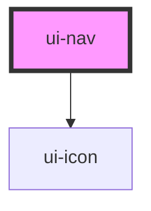

# ui-nav

<!-- Auto Generated Below -->

## Overview

Primary navigation: a horizontal tab row, or a fixed bottom tab bar when
`orientation="bottom"` (the app flips it from a media query). Items are plain
same-origin anchors so the app's link interceptor handles navigation — the
component never calls `preventDefault` or emits a navigate event.

## Properties

| Property      | Attribute     | Description                    | Type                  | Default     |
| ------------- | ------------- | ------------------------------ | --------------------- | ----------- |
| `current`     | `current`     | Route name of the active item. | `string \| undefined` | `undefined` |
| `items`       | --            |                                | `NavItem[]`           | `[]`        |
| `orientation` | `orientation` |                                | `"bottom" \| "top"`   | `'top'`     |

## Dependencies

### Depends on

- [ui-icon](../ui-icon)

### Graph

----------------------------------------------

*Built with [StencilJS](https://stenciljs.com/)*
