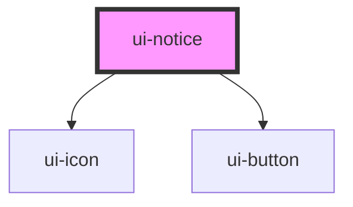

# ui-notice

<!-- Auto Generated Below -->

## Overview

Inline banner. Positioning (a fixed top bar, a toast stack) is the app's job.
`danger` is announced assertively (`role="alert"`); the other tones are polite.

## Properties

| Property      | Attribute     | Description                                 | Type                                   | Default  |
| ------------- | ------------- | ------------------------------------------- | -------------------------------------- | -------- |
| `dismissible` | `dismissible` | Shows a close control that emits `dismiss`. | `boolean`                              | `false`  |
| `tone`        | `tone`        |                                             | `"danger" \| "info" \| "ok" \| "warn"` | `'info'` |

## Events

| Event     | Description                                                                               | Type                |
| --------- | ----------------------------------------------------------------------------------------- | ------------------- |
| `dismiss` | Fired when the close control is activated. The host decides whether to remove the notice. | `CustomEvent<void>` |

## Slots

| Slot | Description      |
| ---- | ---------------- |
|      | The default slot |

## Dependencies

### Depends on

- [ui-icon](../ui-icon)
- [ui-button](../ui-button)

### Graph

----------------------------------------------

*Built with [StencilJS](https://stenciljs.com/)*
